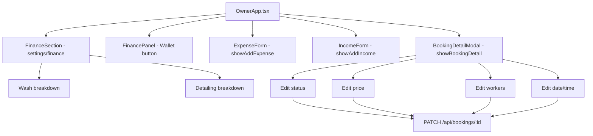

# Design Document: Owner Finance & Booking Improvements

## Overview

Four targeted frontend improvements to `OwnerApp.tsx` that enhance the owner's financial visibility and booking management capabilities. The backend already supports all required operations. All changes are confined to the React frontend.

## Architecture



## Components and Interfaces

### Component 1: FinanceSection (settings → finance)

**Purpose**: Detailed financial report with wash/detailing breakdown in owner settings.

**Interface**:
```typescript
// Computed values derived from existing state
const washRevenue = completedBookings
  .filter(b => services.find(s => s.id === b.serviceId)?.resourceGroup === 'wash')
  .reduce((s, b) => s + b.price, 0);

const detailingRevenue = completedBookings
  .filter(b => services.find(s => s.id === b.serviceId)?.resourceGroup === 'detailing')
  .reduce((s, b) => s + b.price, 0);

const washExpenses = expenses
  .filter(e => e.serviceCategory === 'wash')
  .reduce((s, e) => s + e.amount, 0);

const detailingExpenses = expenses
  .filter(e => e.serviceCategory === 'detailing')
  .reduce((s, e) => s + e.amount, 0);

const washIncomes = incomes
  .filter(i => i.serviceCategory === 'wash')
  .reduce((s, i) => s + i.amount, 0);

const detailingIncomes = incomes
  .filter(i => i.serviceCategory === 'detailing')
  .reduce((s, i) => s + i.amount, 0);
```

**Responsibilities**:
- Display total summary (revenue, expenses, incomes, profit)
- Display wash-specific breakdown
- Display detailing-specific breakdown
- List recent expenses and incomes with category labels

### Component 2: ExpenseForm

**Purpose**: Modal form for adding expenses with date picker and serviceCategory field.

**Interface**:
```typescript
interface ExpenseFormState {
  title: string;
  amount: string;
  category: string;       // existing: Автомойка, Детейлинг, etc.
  serviceCategory: string; // new: '' | 'wash' | 'detailing'
  date: string;           // DD.MM.YYYY
  note: string;
}
```

**Responsibilities**:
- Render `<input type="date">` for date field (already done — keep as-is)
- Add "Категория услуги" select: Общее / Автомойка / Детейлинг
- Pass `serviceCategory` to `addExpense()` API call

### Component 3: IncomeForm

**Purpose**: Modal form for adding incomes with date picker and serviceCategory field.

**Interface**:
```typescript
interface IncomeFormState {
  amount: string;
  source: string;
  note: string;
  date: string;           // DD.MM.YYYY
  serviceCategory: string; // new: '' | 'wash' | 'detailing' (replaces segment)
}
```

**Responsibilities**:
- Render `<input type="date">` for date field (already done — keep as-is)
- Rename/repurpose existing "Раздел" select to "Категория услуги" with values: Общее / Автомойка / Детейлинг
- Pass `serviceCategory` to `addIncome()` API call

### Component 4: BookingDetailModal

**Purpose**: Allow owner to edit bookings (status, price, workers, date/time) like admin.

**Interface**:
```typescript
type OwnerBookingEditMode = null | 'status' | 'price' | 'workers' | 'datetime';

// Existing state already declared:
// ownerBookingEditMode, ownerBookingEditStatus, ownerBookingEditPrice,
// ownerBookingEditDate, ownerBookingEditTime, ownerBookingEditWorkers,
// ownerBookingEditSaving, ownerBookingEditError
```

**Responsibilities**:
- Show edit buttons for status, price, workers, date/time in booking detail view
- Inline edit panels that appear when edit mode is active
- Call `updateBooking(id, patch)` on save
- Show error message on failure
- Update `selectedBooking` state on success

## Data Models

### Expense (extended)
```typescript
interface Expense {
  id: string;
  title: string;
  amount: number;
  category: string;
  date: string;
  note?: string;
  serviceCategory?: string; // 'wash' | 'detailing' | '' — new field
}
```

### Income (extended)
```typescript
interface Income {
  id: string;
  amount: number;
  source: string;
  note?: string | null;
  createdById: string;
  date: string;
  createdAt: string;
  serviceCategory?: string; // 'wash' | 'detailing' | '' — new field
}
```

## Key Functions with Formal Specifications

### handleSaveOwnerBookingEdit()

**Preconditions:**
- `selectedBooking` is non-null
- `ownerBookingEditMode` is non-null
- Relevant edit fields are valid (price >= 0, date is valid DD.MM.YYYY, time is HH:MM)

**Postconditions:**
- Calls `updateBooking(selectedBooking.id, patch)` with only the changed fields
- On success: updates `selectedBooking` state, resets `ownerBookingEditMode` to null
- On error: sets `ownerBookingEditError` with error message

### Profit display helper

```typescript
function profitDisplay(profit: number, isDark: boolean) {
  return {
    value: Math.abs(profit),
    color: profit >= 0 ? accent : '#FF6B6B',
    suffix: profit < 0 ? ' (убыток)' : '',
  };
}
```

**Postconditions:**
- `value` is always >= 0
- `color` is red iff `profit < 0`
- `suffix` is `' (убыток)'` iff `profit < 0`

## Error Handling

### Booking edit error
- **Condition**: PATCH `/api/bookings/{id}` returns non-2xx
- **Response**: Set `ownerBookingEditError` with error message string
- **Recovery**: User can retry or close the edit panel

### Invalid date in forms
- **Condition**: Date input produces invalid `parseFlexibleDate` result
- **Response**: Show inline error message, disable save button
- **Recovery**: User corrects the date

## Correctness Properties

*A property is a characteristic or behavior that should hold true across all valid executions of a system — essentially, a formal statement about what the system should do.*

### Property 1: Profit absolute value invariant

*For any* value of `profit` (positive, negative, or zero), the displayed numeric value SHALL equal `Math.abs(profit)`, which is always >= 0.

**Validates: Requirements 4.1, 4.2, 4.7**

### Property 2: Profit color correctness

*For any* value of `profit`, the display color SHALL be red (`#FF6B6B`) if and only if `profit < 0`, and green/accent otherwise.

**Validates: Requirements 4.3, 4.4, 4.5, 4.6**

### Property 3: Category revenue partition

*For any* set of completed bookings, the sum of wash revenue and detailing revenue SHALL be less than or equal to total revenue (bookings without a matching service resourceGroup contribute to neither category).

**Validates: Requirements 1.4, 1.7**

### Property 4: Expense serviceCategory filter

*For any* set of expenses, filtering by `serviceCategory === 'wash'` and `serviceCategory === 'detailing'` SHALL produce disjoint subsets whose union is a subset of all expenses.

**Validates: Requirements 1.5, 1.6**

## Testing Strategy

### Unit Testing Approach
- Test profit display helper with positive, negative, and zero values
- Test category revenue computation with mixed resourceGroup bookings

### Property-Based Testing Approach
- Property 1 & 2: Generate arbitrary profit values, verify display invariants
- Property 3: Generate arbitrary booking sets, verify revenue partition
- Property 4: Generate arbitrary expense sets, verify category filter disjointness

**Property Test Library**: fast-check (already in project or vitest)

### Integration Testing Approach
- Verify PATCH booking endpoint is called with correct payload on owner edit save
- Verify expense/income forms pass `serviceCategory` to API
